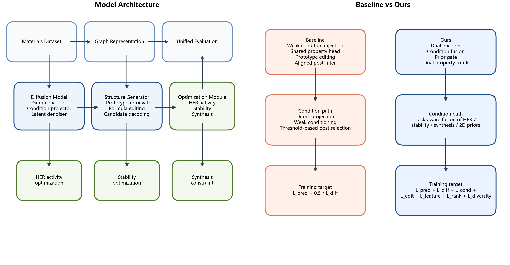
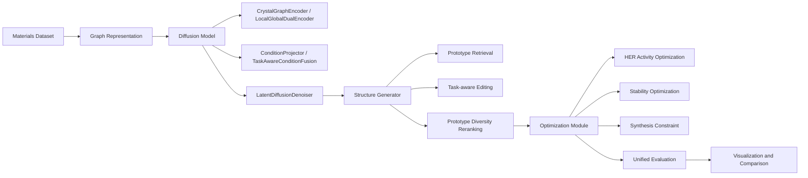
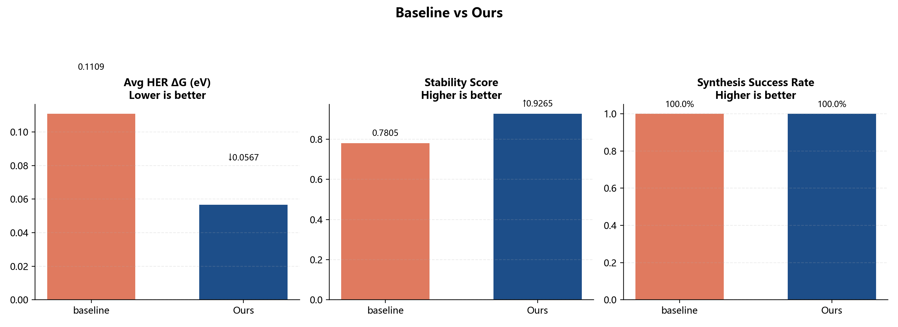
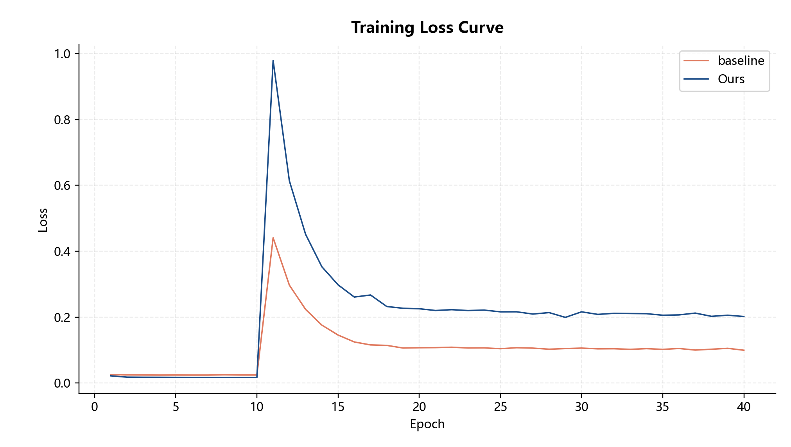
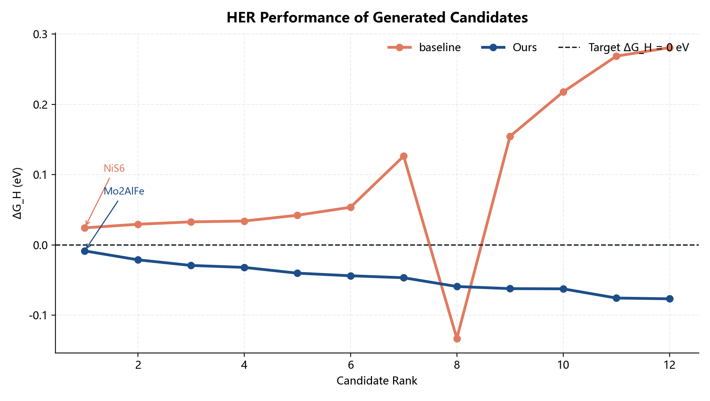
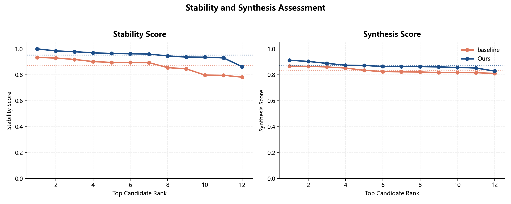
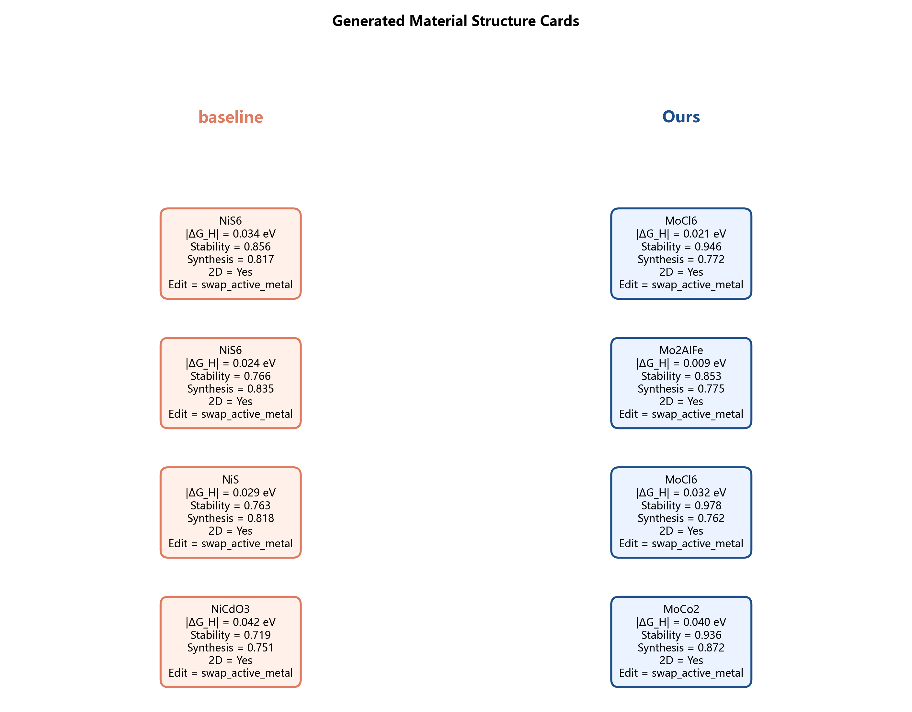

# HER Material Generation

本项目面向析氢反应（HER）催化材料设计，使用图扩散生成框架学习材料结构特征，并通过联合优化同时提升 HER 活性、结构稳定性与可合成性。项目提供完整的训练、再训练、候选生成、统一评分、结构文件导出与结果可视化流程。

本仓库中的 `baseline` 不是随意定义的基础模型，而是对齐 `https://github.com/deamean/material_generation` 仓库**核心主链路与后处理筛选语义**后的规范化重写版；`ours` 在此基础上进一步引入任务化结构增强模块与联合优化目标。

## 项目结构

```text
material_gen/
├── models/
│   ├── diffusion_model.py
│   ├── structure_generator.py
│   └── optimization.py
├── dataset/
│   └── material_dataset.py
├── utils/
│   ├── geo_utils.py
│   └── vis.py
├── train.py
├── test.py
├── README.md
├── requirements.txt
└── results/
    ├── loss_curve.png
    ├── her_performance.png
    ├── stability_curve.png
    ├── generated_structures.png
    ├── model_architecture.png
    ├── baseline_comparison.png
    ├── checkpoints/
    ├── generated_structures/
    └── metrics/
```

## 运行前准备

### 1. 环境准备

建议使用独立 conda 环境：

```bash
conda create -n material_gen python=3.10
conda activate material_gen
pip install -r requirements.txt
```

### 2. 数据准备与 `MP_API_KEY`

本项目支持两种数据路径：

- 默认正式子集：直接读取本地 `dataset/materials_project/` 缓存
- 扩展规模训练：当你希望把 `mp-limit` 从 `6000` 扩到 `10000` 或更大时，再通过 `Materials Project` API 补抓数据

什么时候需要 `MP_API_KEY`：

- **默认运行不一定需要**
  如果你本地已经存在 `dataset/materials_project/raw/` 和 `dataset/materials_project/processed/` 缓存，默认命令可以直接运行。
- **扩展规模或本地没有缓存时需要**
  当你使用 `--download-if-missing` 或希望补齐更大数据规模时，需要先在当前 shell 设置 `MP_API_KEY`。

PowerShell 设置示例：

```powershell
$env:MP_API_KEY="your_materials_project_api_key"
```

### 3. 默认运行路径与扩展运行路径

- 默认正式命令：使用当前本地已验证缓存规模 `mp-limit=6000`
- 扩展正式命令：使用 `mp-limit=10000` 并补抓更多数据，需先设置 `MP_API_KEY`

## 模型结构图



<details>
<summary>展开 Mermaid 源码</summary>



</details>

### 模块说明

- `Diffusion Model`
  对材料图进行编码，并把 HER、稳定性、可合成性和二维先验注入潜空间扩散模型。
- `Structure Generator`
  从原型库中检索相似结构，并通过任务化编辑动作生成候选材料。
- `Optimization Module`
  统一优化 HER 活性、结构稳定性和可合成性，再输出可比较的综合指标。

## 材料生成流程

1. 从 `dataset/material_dataset.py` 读取 `builtin` 模板集或 `materials_project` 本地缓存。
2. 将真实结构或化学式转换为图表示，构造节点特征、边特征和四个训练目标。
3. 通过 `models/diffusion_model.py` 编码图结构，得到潜空间表示。
4. 将 HER、稳定性、可合成性和二维约束编码为条件向量，送入潜空间扩散去噪器。
5. 通过 `models/structure_generator.py` 进行原型检索、编辑动作预测和多样性重排。
6. 使用 `models/optimization.py` 统一计算 `ΔG_H`、稳定性分数和可合成性分数。
7. baseline 额外执行对齐 `material_generation` 语义的后处理筛选：稳定性阈值、可合成性阈值、二维偏好、元素复杂度约束和重复候选去重。
8. 导出候选结构文件，并生成损失曲线、HER 排序图、稳定性/可合成性评估图和结构卡片图。

## 优化模块与必要公式

### HER 活性优化

目标不是单纯让数值越小越好，而是让 `ΔG_H` 尽量接近 `0 eV`：

```math
\mathcal{L}_{HER} = \left|\Delta G_H - 0\right|
```

### baseline 联合训练目标

```math
\mathcal{L}_{baseline} = \mathcal{L}_{pred} + 0.5 \mathcal{L}_{diff}
```

### ours 联合训练目标

```math
\mathcal{L}_{ours} =
\mathcal{L}_{pred}
+ \mathcal{L}_{diff}
+ \mathcal{L}_{cond}
+ \mathcal{L}_{edit}
+ \mathcal{L}_{feature}
+ \mathcal{L}_{rank}
+ \mathcal{L}_{diversity}
```

其中：

- `L_pred`：HER / 稳定性 / 可合成性 / 二维性预测损失
- `L_diff`：扩散去噪损失
- `L_cond`：目标条件一致性损失
- `L_edit`：结构编辑动作监督损失
- `L_feature`：结构先验一致性损失
- `L_rank`：鼓励低 `|ΔG_H|` 且高稳定性的排序损失
- `L_diversity`：约束 top-k 候选不要塌缩到同一类公式

## 创新点

### baseline（material_generation 对齐重写版）

- 使用弱条件注入的基础图扩散生成器。
- 使用单共享属性头预测 HER、稳定性、可合成性和二维性。
- 使用基础原型检索与编辑。
- 显式加入对齐 `material_generation` 的后处理筛选：
  - 低 `|ΔG_H|` 候选优先
  - 稳定性阈值过滤
  - 可合成性阈值过滤
  - 二维 / 层状候选偏好
  - 重复公式和近似候选去重

### ours

#### 架构创新

- 引入 `LocalGlobalDualEncoder`，融合局部图结构与全局化学组成信息。
- 引入 `TaskAwareConditionFusion`，显式融合 HER、稳定性、可合成性和二维先验，而不是简单拼接条件向量。
- 引入 `StructurePriorGate`，用活性金属、promoter、二维性和复杂度先验调制 latent。
- 引入 `DualPropertyTrunk`，将 HER 分支与稳定性/可合成性分支解耦。
- 引入 `HERSitePreferenceHead`，显式建模 HER 活性位点偏好。

#### 优化创新

- 联合优化 HER、稳定性和可合成性，而不是只优化单一代理指标。
- 通过原型检索与任务化编辑动作，让生成结果更具可解释性。
- 引入 `PrototypeDiversityReranker`，提高 top-k 候选的多样性。
- 使用统一综合评分器，保证 baseline 与 ours 的比较口径一致。

## Baseline 与 Ours

### 架构对比

| Module | Baseline | Ours | Task Benefit |
| --- | --- | --- | --- |
| 编码器 | `CrystalGraphEncoder` | `CrystalGraphEncoder + LocalGlobalDualEncoder` | 同时利用局部结构和全局组成 |
| 条件注入 | 条件投影后弱注入 | `TaskAwareConditionFusion` | 更强的多目标条件控制 |
| 结构先验 | 仅弱条件体现 | `StructurePriorGate` | 采样更偏向层状活性结构 |
| 属性头 | 单共享属性头 | `DualPropertyTrunk + HERSitePreferenceHead` | HER 与可落地性协同优化 |
| 生成后处理 | 对齐 `material_generation` 的阈值筛选与去重 | `PrototypeDiversityReranker + task-aware selection` | 同时兼顾质量与多样性 |
| 损失 | `L_pred + 0.5 * L_diff` | `L_pred + L_diff + L_cond + L_edit + L_feature + L_rank + L_diversity` | 同时优化质量、一致性和多样性 |

### 对比结果

下表使用最近一次本地验证结果，统计口径为每种方法 `top-k=10` 候选的平均指标。箭头只加在 `Ours` 行：

- `Avg HER ΔG (eV)`：越低越好，ours 更优时用 `↓`
- `Stability Score` / `Synthesis Success Rate`：越高越好，ours 更优时用 `↑`

[Final_Comparison](./results/metrics/final_comparison.md)

| Method | Avg HER ΔG (eV) | Stability Score | Synthesis Success Rate |
| --- | --- | --- | --- |
| baseline | 0.1109 | 0.7805 | 100.0% |
| Ours | ↓0.0567 | ↑0.9265 | 100.0% |




## 结果可视化

### 1. 训练损失曲线



### 2. HER 性能图

该图展示 top-k 候选的 `ΔG_H` 排序情况，并用 `0 eV` 虚线标出目标位置。



### 3. 稳定性与可合成性评估曲线

左图展示稳定性排序，右图展示可合成性排序。



### 4. 生成材料结构图

图中展示每种方法的代表性候选结构卡片；对应的结构文件会导出到 `results/generated_structures/`。



## 实验参数与指标

默认正式子集参数：

- `data_source = materials_project`
- `mp_limit = 10000`
- `epochs = 40`
- `batch_size = 16`
- `num_samples = 32`
- `top_k = 10`
- `hidden_dim = 256`
- `latent_dim = 128`
- `num_layers = 6`
- `diffusion_steps = 60`

指标定义：

- `Avg HER ΔG (eV)`：top-k 候选平均 `|ΔG_H|`，越低越好
- `Stability Score`：top-k 候选平均稳定性代理分数，越高越好
- `Synthesis Success Rate`：top-k 候选中可合成性分数大于等于 `0.60` 的比例，越高越好

## 运行方式

### 默认训练命令

```bash
  python train.py --method both --data-source materials_project --mp-cache-dir dataset/materials_project --mp-limit 6000 --download-if-missing True --epochs 20 --batch-size 8 --device cuda --output-dir results
```

### 默认生成与评估命令

```bash
python test.py --method both --data-source materials_project --mp-cache-dir dataset/materials_project --mp-limit 6000 --download-if-missing True --num-samples 32 --top-k 10 --epochs 20 --batch-size 8 --device cuda --output-dir results
```

### 再训练命令

```bash
python train.py --method both --data-source materials_project --mp-cache-dir dataset/materials_project --mp-limit 6000 --epochs 20 --batch-size 8 --device cuda --resume --output-dir results
```

### CPU 兜底命令

```bash
python test.py --method both --data-source materials_project --mp-cache-dir dataset/materials_project --mp-limit 6000 --num-samples 32 --top-k 10 --epochs 20 --batch-size 8 --device cpu --output-dir results
```

### 扩展规模命令

如果你希望扩展到更大训练规模，请先设置 `MP_API_KEY`，再执行：

```bash
python train.py --method both --data-source materials_project --mp-cache-dir dataset/materials_project --mp-limit 10000 --download-if-missing True --epochs 40 --batch-size 16 --device cuda --output-dir results
```

```bash
python test.py --method both --data-source materials_project --mp-cache-dir dataset/materials_project --mp-limit 10000 --download-if-missing True --num-samples 128 --top-k 12 --epochs 40 --batch-size 16 --device cuda --output-dir results
```

## 输出文件说明

核心结果图：

- `results/loss_curve.png`
- `results/her_performance.png`
- `results/stability_curve.png`
- `results/generated_structures.png`

辅助展示图：

- `results/model_architecture.png`
- `results/baseline_comparison.png`

结构文件与权重：

- `results/generated_structures/*.cif`
- `results/checkpoints/baseline_best.pt`
- `results/checkpoints/baseline_latest.pt`
- `results/checkpoints/ours_best.pt`
- `results/checkpoints/ours_latest.pt`

运行期日志与指标：

[//]: # (- `results/runtime_logs/<method>/epoch_metrics.csv`)
[//]: # (- `results/runtime_logs/<method>/step_metrics.csv`)
- `results/metrics/final_comparison.csv`
- `results/metrics/final_comparison.md`

## 项目输出自检清单

- 仓库是否包含完整代码、`README.md` 和 `requirements.txt`
- 模型是否能正常训练、保存权重并支持再训练
- README 是否包含结构图、公式、实验参数、指标、创新点和对比表
- `results/` 下是否存在 4 张核心图和 2 张辅助图
- `results/generated_structures/` 下是否至少导出 10 个 baseline 结构文件和 10 个 ours 结构文件
- `results/checkpoints/` 下是否存在 baseline 与 ours 的 best/latest 权重
- `baseline_comparison.png` 是否清晰展示 3 项核心指标对比
- `her_performance.png` 是否清晰展示 baseline 与 ours 的 `ΔG_H` 对比
- `stability_curve.png` 是否同时展示稳定性与可合成性
- `generated_structures.png` 是否与导出的结构文件对应
